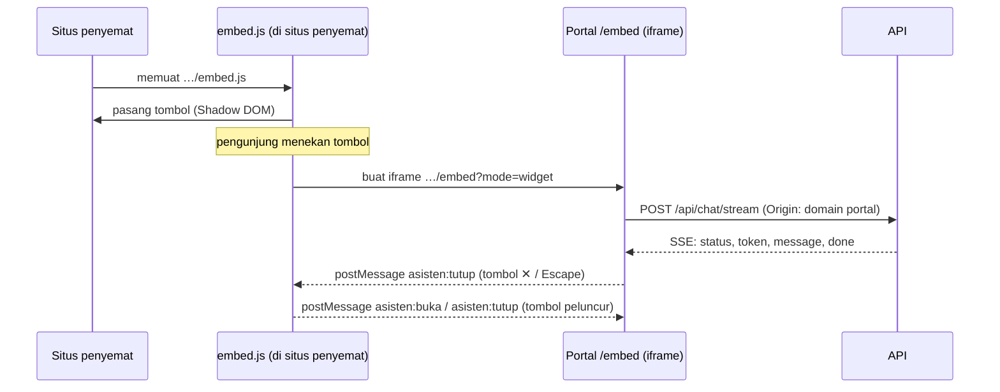

# Sematan Asisten di Situs Lain

Asisten administrasi bisa dipasang di situs mana pun (situs fakultas, PMB, LMS)
dengan **satu baris**:

```html
<script src="https://<domain-portal>/embed.js" async></script>
```

`<domain-portal>` adalah domain tempat portal ini (`client/`) di-deploy (mis.
`sads.instiki.ac.id`), **bukan** domain API. Situs penyemat tidak menyalin
desain, tidak memanggil API, dan tidak butuh kunci apa pun.

Contoh yang bisa langsung dijalankan: [`index.html`](index.html) — lihat
[Menjalankan contoh ini](#menjalankan-contoh-ini).

> Seluruh kodenya ada di repo ini; `api/` tidak berubah sama sekali. Alasannya
> di [Cara kerja](#cara-kerja). Path di dokumen ini relatif terhadap akar
> `client/`.

---

## Memasang

1. Tempel baris di atas tepat sebelum `</body>` — di setiap halaman yang ingin
   menampilkan asisten, atau sekali di template/layout situs.
2. Bila portal mengisi `EMBED_ALLOWED_ORIGINS`, minta pengelola portal
   menambahkan domain situs Anda (lihat [Konfigurasi di portal](#konfigurasi-di-portal)).
   Situs yang tidak terdaftar tetap mendapat tombolnya, tetapi panelnya ditolak
   peramban.
3. Bila situs Anda punya Content Security Policy sendiri, izinkan domain portal
   di `script-src` dan `frame-src`:

   ```text
   Content-Security-Policy: script-src 'self' https://<domain-portal>; frame-src https://<domain-portal>
   ```

   `style-src` tidak perlu diubah.
4. Muat ulang halaman. Tombol merah **Tanya Asisten** muncul di pojok kanan
   bawah.

Pengunjung mendapat asisten yang sama persis dengan widget di portal: jawaban
yang mengalir, sumber PDF yang bisa diklik, banner eskalasi, 👍/👎 beserta
catatannya, dan tampilan layar sempit. Perubahan desain di portal otomatis
berlaku di semua situs penyemat; tidak ada salinan yang perlu diperbarui.

Yang perlu diketahui pemilik situs:

- **Tidak memberatkan halaman.** Saat halaman dibuka yang dimuat hanya
  `embed.js` (±7 KB, ±3 KB setelah gzip). Panelnya baru dimuat saat tombol
  pertama kali ditekan.
- **Tidak bentrok dengan CSS situs.** Tombol hidup di Shadow DOM dan panel di
  iframe: gaya situs penyemat tidak bisa merusaknya, dan sebaliknya.
- **Terpasang dua kali tetap satu tombol**, mis. lewat template dan tag manager
  sekaligus.
- **Selalu di atas.** Tombol dan panel memakai `z-index: 2147483000`. Widget
  lain di pojok kanan bawah (chat CS, tombol "kembali ke atas") akan tertutup;
  pindahkan widget tersebut.
- **Percakapan hilang saat pindah halaman**, sama seperti widget di portal:
  setiap halaman situs penyemat memuat panel baru.

### Tanpa script

| Kebutuhan | Pasang |
|---|---|
| Tautan ke halaman chat penuh | `<a href="https://<domain-portal>/embed">Tanya Asisten</a>` |
| Panel tertanam di badan halaman | `<iframe src="https://<domain-portal>/embed" title="Asisten Administrasi" style="width:100%;height:600px;border:0"></iframe>` |

Keduanya membuka `/embed` tanpa `?mode=widget`, jadi panel tampil tanpa tombol
tutup — tidak ada yang bisa ditutup. Panel mengisi tinggi iframe dan melebar
sampai 760 px. Iframe langsung tetap tunduk pada `EMBED_ALLOWED_ORIGINS`;
tautan tidak, karena dibuka sebagai halaman biasa.

---

## Cara kerja



- **Permintaan ke API berangkat dari iframe**, jadi `Origin`-nya domain portal,
  bukan domain situs penyemat. `CORS_ORIGINS` di API cukup memuat domain portal
  — yang memang sudah ada karena portal sendiri memakainya. Domain situs
  penyemat **tidak perlu** ditambahkan ke sana.
- **Batas laju tetap berlaku.** `session_id` disimpan di `localStorage` milik
  iframe. Peramban modern memisahkan penyimpanan iframe per situs induk, jadi
  pengunjung yang sama di dua situs penyemat dan di portal tercatat sebagai tiga
  sesi. Bila `localStorage` diblokir, sesi berlaku per tab (`lib/session.ts`).
- **Pesan antara `embed.js` dan iframe hanya sinyal buka/tutup.** Isi
  percakapan tidak pernah keluar dari iframe.

  | Pesan | Arah | Arti |
  |---|---|---|
  | `{type: "asisten:buka"}` | situs → iframe | Panel ditampilkan lagi; fokus kembali ke kotak pertanyaan |
  | `{type: "asisten:tutup"}` | situs → iframe | Ditutup lewat tombol peluncur di situs |
  | `{type: "asisten:tutup"}` | iframe → situs | Ditutup lewat ✕ atau Escape di panel; situs menyembunyikan iframe dan mengembalikan fokus ke tombol |

  `embed.js` hanya menerima pesan yang `origin`-nya domain portal **dan**
  `source`-nya iframe miliknya sendiri. Iframe hanya menerima pesan dari
  `window.parent`. Nama pesan harus sama di `public/embed.js` dan
  `src/components/chat/embedded-chat.tsx`.
- **Domain portal dibaca dari `src` script itu sendiri** (`document.currentScript`),
  jadi `embed.js` tidak menyimpan alamat apa pun dan berkas yang sama berlaku
  di dev, staging, dan produksi.
- **Gaya tombol dipasang lewat constructable stylesheet** (`adoptedStyleSheets`),
  bukan `<style>`. CSP `style-src` tidak mengatur stylesheet yang dibangun lewat
  CSSOM, jadi situs dengan CSP ketat tidak perlu `'unsafe-inline'`.

---

## Konfigurasi di portal

| Variabel (`.env.local`) | Isi |
|---|---|
| `EMBED_ALLOWED_ORIGINS` | Situs yang boleh memuat `/embed` dalam iframe, dipisah koma, mis. `https://www.instiki.ac.id,https://pmb.instiki.ac.id`. Kosong = situs mana pun. |

- **Dibaca saat `npm run build`**, bukan saat server berjalan — sama seperti
  `NEXT_PUBLIC_API_BASE_URL`. Mengubahnya berarti build ulang; di server cukup
  ubah `.env.local` lalu jalankan `start.sh`, yang sudah menjalankan build.
- **Isi di produksi.** Setiap pertanyaan dari situs penyemat memakai kuota model
  AI kampus, dan tanpa daftar ini situs mana pun bisa memasang asisten.
- Tulis asal lengkap — skema, domain, dan port bila bukan 80/443 — tanpa path.
  Garis miring di akhir dibuang otomatis. Wildcard subdomain ala CSP berlaku:
  `https://*.instiki.ac.id` mencakup semua subdomain, tetapi **tidak**
  `https://instiki.ac.id` itu sendiri.
- Hasilnya satu header pada `/embed` saja; halaman portal lain tidak berubah:

  ```bash
  curl -sI https://<domain-portal>/embed | grep -i content-security
  # kosong:  Content-Security-Policy: frame-ancestors *
  # terisi:  Content-Security-Policy: frame-ancestors 'self' https://www.instiki.ac.id https://pmb.instiki.ac.id
  ```

- **Caddy / reverse proxy:** jangan menambahkan `Content-Security-Policy`
  sendiri untuk `/embed` — dua kebijakan berlaku bersamaan dan yang lebih ketat
  menang. Jangan pula memasang `X-Frame-Options` di sana.

---

## Menjalankan contoh ini

Butuh tiga proses: API, portal, dan server statis untuk `index.html`.
Situs contoh harus berasal dari **asal yang berbeda** dari portal agar
pengujiannya sama dengan situs eksternal sungguhan.

```bash
# Dari folder induk yang berisi api/ dan client/.

# 1. API, di :8000 (butuh tunnel DB, lihat api/docs/start.md)
cd api && uvicorn app.main:app --reload

# 2. Portal, di :3001 — port 3000 dipakai admin/, dan localhost:3001 sudah
#    diizinkan CORS API saat ENVIRONMENT=local
cd client && npm run dev -- -p 3001

# 3. Situs contoh, di :5500
cd client/docs && python -m http.server 5500
```

Buka `http://localhost:5500/`, lalu tekan **Tanya Asisten**. Alamat portal di
`index.html` ditulis `http://localhost:3001`; ganti bila portal berjalan di
tempat lain.

- **Portal sudah berjalan dengan `npm run dev` di port lain?** Next.js 16
  menolak `next dev` kedua untuk direktori yang sama ("Another next dev server
  is already running"). Pakai server yang sudah ada dan ganti port di baris
  `<script>` terakhir `index.html`.

- **Jangan membuka `index.html` dengan klik ganda.** Lewat `file://` tombolnya
  muncul, tetapi panelnya ditolak: `frame-ancestors *` hanya mencakup situs
  http/https. Halaman contoh menampilkan peringatan bila dibuka begitu.
- Bila portal belum berjalan, halaman contoh juga menampilkan peringatan
  "embed.js tidak termuat".
- Setiap pertanyaan yang dikirim tercatat di tabel `conversations` database
  yang dipakai API, seperti pertanyaan dari portal. Bersihkan percakapan uji
  dari DB dev bila perlu.

---

## Pemecahan masalah

Hampir semua masalah terlihat di konsol DevTools situs penyemat.

| Gejala | Pesan di konsol | Penyebab dan perbaikan |
|---|---|---|
| Tombol tidak muncul | `net::ERR_CONNECTION_REFUSED` / 404 untuk `embed.js` | Alamat script salah atau portal mati. Buka URL `embed.js` langsung di peramban. |
| Tombol tidak muncul | `Loading the script '…/embed.js' violates … "script-src …"` | CSP situs penyemat. Tambahkan domain portal ke `script-src`. |
| Tombol muncul, panel kosong | `Framing '…' violates … "frame-ancestors …"` | Situs belum terdaftar di `EMBED_ALLOWED_ORIGINS`, atau halaman dibuka lewat `file://`. Tambahkan asalnya lalu **build ulang** portal. |
| Tombol muncul, panel kosong | `Framing '…' violates … "frame-src …"` | CSP situs penyemat. Tambahkan domain portal ke `frame-src`. |
| Panel tampil, jawaban berisi "Tidak dapat terhubung ke server" | Galat CORS atau `ERR_CONNECTION_REFUSED` untuk alamat API | API mati, `NEXT_PUBLIC_API_BASE_URL` portal salah, atau domain portal tidak ada di `CORS_ORIGINS` API. Periksa `GET /health`. |
| `EMBED_ALLOWED_ORIGINS` diubah tetapi tidak berpengaruh | — | Nilainya dibekukan saat build. Jalankan `npm run build` / `start.sh` lagi. |

Pesan dari iframe ikut tampil di konsol yang sama. Untuk menjalankan perintah
di dalam iframe, ganti konteks `top` di tab Console ke frame `/embed`.

---

## Batasan

- Belum ada opsi tampilan: tombol selalu di kanan bawah dengan warna dan teks
  portal.
- Warna dan ukuran tombol serta panel di `embed.js` disalin dari `.launcher` dan
  `.panel` di `chat.module.css`. Mengubah salah satunya berarti mengubah
  keduanya.
- `embed.js` disajikan apa adanya dari `public/`, tanpa transpilasi.
  Kodenya memakai JavaScript modern (arrow function, template literal,
  `adoptedStyleSheets`) dan hanya ditujukan untuk peramban evergreen.

---

## Berkas terkait

| Berkas | Isi |
|---|---|
| [`public/embed.js`](../public/embed.js) | Skrip sematan: tombol, iframe, pesan buka/tutup |
| [`src/app/embed/page.tsx`](../src/app/embed/page.tsx) | Halaman `/embed` |
| [`src/components/chat/embedded-chat.tsx`](../src/components/chat/embedded-chat.tsx) | Mode widget vs. halaman penuh; penerima pesan dari `embed.js` |
| [`src/components/chat/chat-panel.tsx`](../src/components/chat/chat-panel.tsx) | Panel chat, dipakai bersama widget portal |
| [`next.config.ts`](../next.config.ts) | Header `frame-ancestors` dari `EMBED_ALLOWED_ORIGINS` |
| [`.env.example`](../.env.example) | Contoh `EMBED_ALLOWED_ORIGINS` |
| [`docs/index.html`](index.html) | Contoh situs penyemat |
