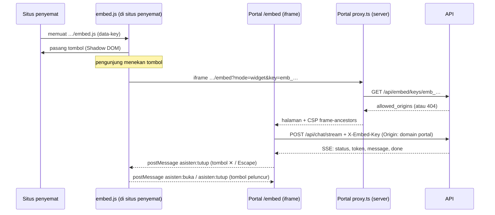

# Sematan Asisten di Situs Lain

Asisten administrasi bisa dipasang di situs mana pun (situs fakultas, PMB, LMS)
dengan **satu baris**:

```html
<script src="https://<domain-portal>/embed.js" data-key="emb_..." async></script>
```

`<domain-portal>` adalah domain tempat portal ini (`client/`) di-deploy (mis.
`sads.instiki.ac.id`), **bukan** domain API. `data-key` adalah **kunci sematan**
situs itu, dibuat superadmin di dashboard admin, menu **Sematan**. Dashboard
menampilkan baris di atas lengkap dan siap tempel. Situs penyemat tidak menyalin
desain dan tidak memanggil API sendiri.

Contoh yang bisa langsung dijalankan: [`index.html`](index.html) — lihat
[Menjalankan contoh ini](#menjalankan-contoh-ini).

> Path di dokumen ini relatif terhadap akar `client/`.

---

## Memasang

1. Superadmin membuat kunci di dashboard admin → **Sematan** → **Buat kunci**:
   nama situs, dan (disarankan) domain situs yang boleh memakainya.
2. Salin **kode sematan** yang ditampilkan, lalu tempel tepat sebelum
   `</body>` — di setiap halaman yang ingin menampilkan asisten, atau sekali di
   template/layout situs.
3. Bila situs Anda punya Content Security Policy sendiri, izinkan domain portal
   di `script-src` dan `frame-src`:

   ```text
   Content-Security-Policy: script-src 'self' https://<domain-portal>; frame-src https://<domain-portal>
   ```

   `style-src` tidak perlu diubah.
4. Muat ulang halaman. Tombol merah **Tanya Asisten** muncul di pojok kanan
   bawah.

Pengunjung mendapat asisten yang sama persis dengan widget di portal: jawaban
yang mengalir, sumber PDF yang bisa diklik, banner eskalasi, 👍/👎 beserta
catatannya, dan tampilan layar sempit. Perubahan desain di portal otomatis
berlaku di semua situs penyemat; tidak ada salinan yang perlu diperbarui.

Yang perlu diketahui pemilik situs:

- **Tidak memberatkan halaman.** Saat halaman dibuka yang dimuat hanya
  `embed.js` (±7 KB, ±3 KB setelah gzip). Panelnya baru dimuat saat tombol
  pertama kali ditekan.
- **Tidak bentrok dengan CSS situs.** Tombol hidup di Shadow DOM dan panel di
  iframe: gaya situs penyemat tidak bisa merusaknya, dan sebaliknya.
- **Terpasang dua kali tetap satu tombol**, mis. lewat template dan tag manager
  sekaligus.
- **Tanpa `data-key`, tombol tidak dipasang** dan konsol menulis peringatan.
- **Selalu di atas.** Tombol dan panel memakai `z-index: 2147483000`. Widget
  lain di pojok kanan bawah (chat CS, tombol "kembali ke atas") akan tertutup;
  pindahkan widget tersebut.
- **Percakapan hilang saat pindah halaman**, sama seperti widget di portal:
  setiap halaman situs penyemat memuat panel baru.

### Tanpa script

| Kebutuhan | Pasang |
|---|---|
| Tautan ke halaman chat penuh | `<a href="https://<domain-portal>/embed">Tanya Asisten</a>` |
| Panel tertanam di badan halaman | `<iframe src="https://<domain-portal>/embed?key=emb_..." title="Asisten Administrasi" style="width:100%;height:600px;border:0"></iframe>` |

Keduanya membuka `/embed` tanpa `?mode=widget`, jadi panel tampil tanpa tombol
tutup — tidak ada yang bisa ditutup. Panel mengisi tinggi iframe dan melebar
sampai 760 px. Iframe tetap butuh `?key=` dan tunduk pada daftar domain kunci
itu; tautan biasa tidak butuh kunci, karena dibuka sebagai halaman penuh —
tetapi tanpa kunci, halaman itu tidak dapat dibingkai situs lain.

---

## Kunci sematan

Satu situs = satu kunci (`emb_` + 24 karakter). Dikelola superadmin di
dashboard admin, menu **Sematan** (`/sematan`):

| Aksi | Akibat |
|---|---|
| Buat kunci | Langsung aktif. Kode sematan siap tempel ditampilkan dan dapat disalin lagi kapan saja. |
| Ubah daftar domain | Berlaku saat panel dibuka berikutnya. Situs penyemat tidak perlu mengganti kodenya. |
| Nonaktifkan | Panel baru menampilkan "Asisten tidak tersedia di situs ini"; panel yang sedang terbuka ditolak pada pertanyaan berikutnya. Dapat diaktifkan lagi. |
| Hapus | Permanen. Situs yang masih memasangnya harus diberi kunci baru. Percakapan dari situs itu tetap tersimpan. |

**Kunci bukan rahasia.** Ia tertulis di kode sumber situs penyemat, jadi siapa
pun bisa menyalinnya. Yang membatasi pemakaiannya adalah **daftar domain**:
peramban sendiri yang menolak menampilkan panel di situs yang tidak terdaftar,
sehingga kunci salinan tidak berguna di sana. Daftar kosong berarti situs mana
pun — dashboard menandainya **Semua situs** supaya tidak terlupa. **Isi daftar
domain di produksi**: setiap pertanyaan dari situs penyemat memakai kuota model
AI kampus.

**Kunci bukan pengaman API.** Daftar domain, `frame-ancestors`, dan CORS
semuanya ditegakkan peramban: ketiganya menahan situs lain yang memasang
panel, tetapi tidak menahan orang yang memanggil `POST /api/chat/stream`
langsung lewat Postman atau skrip — dengan kunci siapa pun, atau tanpa kunci
sama sekali. API chat memang publik tanpa login (PRD v1). Yang menahan
pemanggilan langsung ada di API sendiri: batas laju per IP, per sesi, dan per
situs (`RATE_LIMIT_*`), batas pertanyaan harian yang menyalakan kill switch
(`CHAT_DAILY_LIMIT`, dapat diubah dari halaman Konfigurasi), dan batas panjang
pertanyaan (500 karakter).

Aturan penulisan domain (diperiksa API, dirapikan otomatis):

- Asal lengkap — skema, domain, dan port bila bukan 80/443 — **tanpa path**:
  `https://pmb.instiki.ac.id`, bukan `https://pmb.instiki.ac.id/daftar`.
- Garis miring akhir, huruf besar, dan port bawaan (`:443`) dibuang; duplikat
  dibuang.
- Wildcard subdomain ala CSP diterima: `https://*.instiki.ac.id` mencakup semua
  subdomain, tetapi **tidak** `https://instiki.ac.id` itu sendiri.
- Paling banyak 20 domain per kunci.

Dashboard juga menunjukkan jumlah pertanyaan 30 hari terakhir dan waktu
pertanyaan terakhir per kunci, dari kolom `conversations.embed_key`.

---

## Cara kerja


```mermaid
sequenceDiagram
    participant S as Situs penyemat
    participant E as embed.js (di situs penyemat)
    participant P as Portal /embed (iframe)
    participant X as Portal proxy.ts (server)
    participant A as API

    S->>E: memuat …/embed.js (data-key)
    E->>S: pasang tombol (Shadow DOM)
    Note over E: pengunjung menekan tombol
    E->>X: iframe …/embed?mode=widget&key=emb_…
    X->>A: GET /api/embed/keys/emb_…
    A-->>X: allowed_origins (atau 404)
    X-->>P: halaman + CSP frame-ancestors
    P->>A: POST /api/chat/stream + X-Embed-Key (Origin: domain portal)
    A-->>P: SSE: status, token, message, done
    P-->>E: postMessage asisten:tutup (tombol ✕ / Escape)
    E-->>P: postMessage asisten:buka / asisten:tutup (tombol peluncur)
```

- **Kunci diperiksa di server portal, setiap kali panel dimuat.**
  `src/proxy.ts` bertanya ke `GET /api/embed/keys/{key}` lalu memasang
  `Content-Security-Policy: frame-ancestors 'self' <domain kunci itu>` pada
  `/embed`. Daftar kosong menjadi `frame-ancestors *`. Kunci yang tidak dikenal,
  nonaktif, atau API yang tidak dapat dihubungi menghasilkan halaman pesan
  "tidak tersedia" (tanpa chat) alih-alih panel kosong.
- **Halaman portal lain tidak dapat dibingkai.** `proxy.ts` memasang
  `frame-ancestors 'self'` pada semua halaman selain `/embed` — termasuk `/`,
  yang juga membawa widget chat. Tanpa ini situs mana pun dapat meng-iframe `/`
  dan memakai asisten tanpa kunci.
- **Setiap pertanyaan membawa kuncinya** di header `X-Embed-Key`. API menolak
  (403) kunci yang sudah dinonaktifkan, jadi pencabutan juga menghentikan panel
  yang sedang terbuka, dan mencatat asal percakapan untuk statistik per situs.
  Portal sendiri tidak mengirim header ini.
- **Permintaan ke API berangkat dari iframe**, jadi `Origin`-nya domain portal,
  bukan domain situs penyemat. `CORS_ORIGINS` di API cukup memuat domain portal.
  Domain situs penyemat **tidak perlu** ditambahkan ke sana.
- **Batas laju berlaku per sesi, per IP, dan per situs.** Seluruh pengunjung
  satu situs penyemat berbagi satu jatah per kunci (`RATE_LIMIT_PER_EMBED_SITE`
  di API), supaya satu situs yang ramai tidak menghabiskan kuota milik semua.
  `session_id` disimpan di `localStorage` milik iframe. Peramban modern
  memisahkan penyimpanan iframe per situs induk, jadi pengunjung yang sama di
  dua situs penyemat dan di portal tercatat sebagai tiga sesi. Bila
  `localStorage` diblokir, sesi berlaku per tab (`lib/session.ts`).
- **Pesan antara `embed.js` dan iframe hanya sinyal buka/tutup.** Isi
  percakapan tidak pernah keluar dari iframe.

  | Pesan | Arah | Arti |
  |---|---|---|
  | `{type: "asisten:buka"}` | situs → iframe | Panel ditampilkan lagi; fokus kembali ke kotak pertanyaan |
  | `{type: "asisten:tutup"}` | situs → iframe | Ditutup lewat tombol peluncur di situs |
  | `{type: "asisten:tutup"}` | iframe → situs | Ditutup lewat ✕ atau Escape di panel; situs menyembunyikan iframe dan mengembalikan fokus ke tombol |

  `embed.js` hanya menerima pesan yang `origin`-nya domain portal **dan**
  `source`-nya iframe miliknya sendiri. Iframe hanya menerima pesan dari
  `window.parent`. Nama pesan harus sama di `public/embed.js` dan
  `src/components/chat/embedded-chat.tsx`.
- **Domain portal dibaca dari `src` script itu sendiri** (`document.currentScript`),
  jadi `embed.js` tidak menyimpan alamat apa pun dan berkas yang sama berlaku
  di dev, staging, dan produksi.
- **Gaya tombol dipasang lewat constructable stylesheet** (`adoptedStyleSheets`),
  bukan `<style>`. CSP `style-src` tidak mengatur stylesheet yang dibangun lewat
  CSSOM, jadi situs dengan CSP ketat tidak perlu `'unsafe-inline'`.

---

## Konfigurasi di portal

| Variabel | Isi |
|---|---|
| `API_INTERNAL_URL` | Alamat API dari sisi **server** portal, untuk pemeriksaan kunci di `src/proxy.ts`. Dibaca saat server berjalan, bukan saat build. Kosong = `NEXT_PUBLIC_API_BASE_URL` bila berupa alamat lengkap, atau `http://localhost:8000`. |

- Wajib diisi bila `NEXT_PUBLIC_API_BASE_URL` dikosongkan (portal dan API satu
  domain di balik Caddy), atau bila alamat publik API tidak terjangkau dari
  mesin/kontainer portal. `docker-compose.yml` mengisinya
  `http://host.docker.internal:8000`, karena api memakai jaringan host.
- Di API, isi `PORTAL_URL` (mis. `https://sads.instiki.ac.id`) supaya dashboard
  menampilkan kode sematan siap tempel. Saat `ENVIRONMENT=local` bawaannya
  `http://localhost:3001`.
- Periksa hasilnya pada satu kunci:

  ```bash
  curl -sI "https://<domain-portal>/embed?key=emb_..." | grep -i content-security
  # semua situs:   Content-Security-Policy: frame-ancestors *
  # dibatasi:      Content-Security-Policy: frame-ancestors 'self' https://pmb.instiki.ac.id
  # tanpa kunci:   Content-Security-Policy: frame-ancestors 'self'
  ```

- **Caddy / reverse proxy:** jangan menambahkan `Content-Security-Policy`
  sendiri untuk `/embed` — dua kebijakan berlaku bersamaan dan yang lebih ketat
  menang. Jangan pula memasang `X-Frame-Options` di sana.

---

## Menjalankan contoh ini

Butuh tiga proses: API, portal, dan server statis untuk `index.html`.
Situs contoh harus berasal dari **asal yang berbeda** dari portal agar
pengujiannya sama dengan situs eksternal sungguhan.

```bash
# Dari folder induk yang berisi api/ dan client/.

# 1. API, di :8000 (butuh tunnel DB, lihat api/docs/start.md)
cd api && uvicorn app.main:app --reload

# 2. Portal, di :3001 — port 3000 dipakai admin/, dan localhost:3001 sudah
#    diizinkan CORS API saat ENVIRONMENT=local
cd client && npm run dev -- -p 3001

# 3. Situs contoh, di :5500
cd client/docs && python -m http.server 5500
```

Buat kunci di dashboard admin → **Sematan**, dengan `http://localhost:5500`
di daftar domainnya (atau biarkan kosong). Lalu buka
`http://localhost:5500/?key=emb_...` dan tekan **Tanya Asisten**. Halaman contoh
memasang baris `<script>` dari `?key=` itu; alamat portal di `index.html` ditulis
`http://localhost:3001`, ganti bila portal berjalan di tempat lain.

- **Portal sudah berjalan dengan `npm run dev` di port lain?** Next.js 16
  menolak `next dev` kedua untuk direktori yang sama ("Another next dev server
  is already running"). Pakai server yang sudah ada dan ganti port di
  `index.html`.
- **Jangan membuka `index.html` dengan klik ganda.** Lewat `file://` tombolnya
  muncul, tetapi panelnya ditolak: `frame-ancestors` hanya mencakup situs
  http/https. Halaman contoh menampilkan peringatan bila dibuka begitu.
- Halaman contoh juga memperingatkan bila `?key=` belum diberikan, atau bila
  portal belum berjalan ("embed.js tidak termuat").
- Setiap pertanyaan yang dikirim tercatat di tabel `conversations` database
  yang dipakai API, beserta kuncinya. Bersihkan percakapan uji dari DB dev bila
  perlu.

---

## Pemecahan masalah

Hampir semua masalah terlihat di konsol DevTools situs penyemat.

| Gejala | Pesan di konsol | Penyebab dan perbaikan |
|---|---|---|
| Tombol tidak muncul | `[Asisten Administrasi] Atribut data-key belum diisi…` | Tag `<script>` tanpa `data-key`. Salin kode sematan lengkap dari menu Sematan. |
| Tombol tidak muncul | `net::ERR_CONNECTION_REFUSED` / 404 untuk `embed.js` | Alamat script salah atau portal mati. Buka URL `embed.js` langsung di peramban. |
| Tombol tidak muncul | `Loading the script '…/embed.js' violates … "script-src …"` | CSP situs penyemat. Tambahkan domain portal ke `script-src`. |
| Panel: "Asisten tidak tersedia di situs ini" | — | Kunci salah ketik, dinonaktifkan, atau dihapus. Periksa di menu Sematan. |
| Panel: "Asisten sedang tidak dapat dimuat" | — | Server portal tidak dapat menghubungi API. Periksa `API_INTERNAL_URL` portal dan `GET /health` API. |
| Tombol muncul, panel kosong | `Framing '…' violates … "frame-ancestors …"` | Domain situs belum ada di daftar kunci itu, atau halaman dibuka lewat `file://`. Tambahkan domainnya di menu Sematan — tidak perlu build ulang. |
| Tombol muncul, panel kosong | `Framing '…' violates … "frame-src …"` | CSP situs penyemat. Tambahkan domain portal ke `frame-src`. |
| Jawaban: "Terlalu banyak pertanyaan dalam waktu singkat" | 429 untuk `/api/chat/stream` | Batas laju per IP, per sesi, atau per situs tercapai. Bila banyak pengunjung sah kena, naikkan `RATE_LIMIT_*` di `.env` API (IP kampus dipakai bersama). |
| Jawaban: "Layanan chat sedang dinonaktifkan sementara" | 503 untuk `/api/chat/stream` | Kill switch menyala — bisa karena batas pertanyaan harian tercapai. Lihat alasannya di halaman Konfigurasi dashboard. |
| Panel tampil, jawaban berisi "Tidak dapat terhubung ke server" | Galat CORS atau `ERR_CONNECTION_REFUSED` untuk alamat API | API mati, `NEXT_PUBLIC_API_BASE_URL` portal salah, atau domain portal tidak ada di `CORS_ORIGINS` API. Periksa `GET /health`. |

Pesan dari iframe ikut tampil di konsol yang sama. Untuk menjalankan perintah
di dalam iframe, ganti konteks `top` di tab Console ke frame `/embed`.

---

## Batasan

- Belum ada opsi tampilan: tombol selalu di kanan bawah dengan warna dan teks
  portal.
- Batas laju per situs sama untuk semua kunci (`RATE_LIMIT_PER_EMBED_SITE`);
  belum dapat diatur per kunci dari dashboard.
- Warna dan ukuran tombol serta panel di `embed.js` disalin dari `.launcher` dan
  `.panel` di `chat.module.css`. Mengubah salah satunya berarti mengubah
  keduanya.
- `embed.js` disajikan apa adanya dari `public/`, tanpa transpilasi.
  Kodenya memakai JavaScript modern (arrow function, template literal,
  `adoptedStyleSheets`) dan hanya ditujukan untuk peramban evergreen.

---

## Berkas terkait

| Berkas | Isi |
|---|---|
| [`public/embed.js`](../public/embed.js) | Skrip sematan: tombol, iframe, pesan buka/tutup |
| [`src/proxy.ts`](../src/proxy.ts) | Pemeriksaan kunci dan header `frame-ancestors` seluruh portal |
| [`src/app/embed/page.tsx`](../src/app/embed/page.tsx) | Halaman `/embed` |
| [`src/components/chat/embedded-chat.tsx`](../src/components/chat/embedded-chat.tsx) | Mode widget vs. halaman penuh; halaman "tidak tersedia"; penerima pesan dari `embed.js` |
| [`src/components/chat/chat-panel.tsx`](../src/components/chat/chat-panel.tsx) | Panel chat, dipakai bersama widget portal |
| [`.env.example`](../.env.example) | `API_INTERNAL_URL` |
| [`docs/index.html`](index.html) | Contoh situs penyemat |
| `api/app/embed_keys.py`, `api/app/routers/embed.py`, `api/app/routers/admin_embed_keys.py` | Kunci sematan di API |
| `admin/src/components/embed-keys/` | Halaman Sematan di dashboard |
